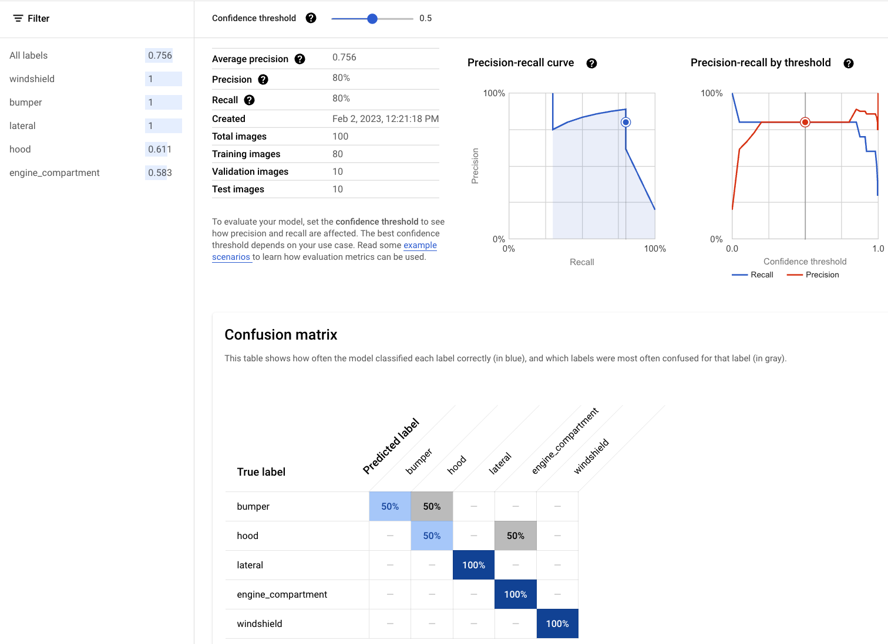

## Introduction

In this repo, we'll create a system which trains an model to identify damaged car parts. We'll use:
- AutoML Vision to train a model.
- Vertex AI pipelines to create a machine learning pipeline.
- Vertex AI endpoints to deploy our model and make live predictions.
- Vision AI to extract extra information about the images.
- VIsion AI to detect similar images on the web to help identify fraud.
- Build a UI and deploy it to Cloud build to make predictions with new data.

## Setup

1. To get started, we'll need to set up a python environment and install the required libraries:

    ```bash
    pipenv shell --python 3.9
    pip install -r requirements.txt
    ```

    We will also need the gcloud cli which can be installed per [these instructions.](https://cloud.google.com/sdk/docs/install)

1. Create a Google cloud project, $PROJECT_ID, and enable the following services:

    ```bash
    gcloud config set project $PROJECT_ID
    gcloud services enable \
    compute.googleapis.com \
    aiplatform.googleapis.com \
    cloudbuild.googleapis.com
    ```

1. Crete a Service account and give it the necessary permissions needed to run a Vertex AI pipeline.

    ```bash
    gcloud iam service-accounts create vertex-ai \
    --description="My Vertex-AI account" \
    --display-name="vertex-ai"
    SVC_ACCOUNT=vertex-ai@${PROJECT_ID}.iam.gserviceaccount.com
    gcloud projects add-iam-policy-binding $PROJECT_ID --member serviceAccount:$SVC_ACCOUNT --role roles/storage.objectAdmin
    gcloud projects add-iam-policy-binding $PROJECT_ID --member serviceAccount:$SVC_ACCOUNT --role  roles/aiplatform.admin
    gcloud projects add-iam-policy-binding $PROJECT_ID --member serviceAccount:$SVC_ACCOUNT --role  roles/iam.serviceAccountUser
    ```

Now you can move on to the next steps to get started.

## Steps

1. Set the following variables as we'll be using them throughout this tutorial.

    ```bash
    PROJECT_ID=<your project id>
    BUCKET_ID=<your bucket id>
    REGION=<your region>

1. We'll be using the dataset from [this](https://www.cloudskillsboost.google/focuses/22020?parent=catalog) cloudskillsboost. First create a bucket and copy the files over.

    ```bash
    gsutil mb -p $PROJECT_ID -c standard -l $REGION gs://$BUCKET_ID
    gsutil -m cp -r gs://car_damage_lab_images/* gs://$BUCKET_ID/data/
    gsutil cp gs://car_damage_lab_metadata/data.csv .
    sed -i -e "s/car_damage_lab_images/$BUCKET_ID\/data/g" ./data.csv
    gsutil cp data.csv gs://$BUCKET_ID/data/
    # Verify files are copied
    gsutil ls gs://$BUCKET_ID/data/
    ```
1. Now it's time to train an AutoML Vision model. For this we'll be using a Vertex AI pipeline which will automate the dataset, automl and endpoint creation. It will create the following:
    - Vertex AI Dataset
    - Vertex AI Model Registry entry with model performance metrics
    - Vertex AI endpoint.

    First set a variable with your email address which will send an email once the pipeline finishes.

    ```bash
    RECIPIENT=<your-email-address>
    ```

    Then call the pipeline.

    ```bash
    python vertex-ai-pipeline/pipeline.py \
    --bucket=gs://$BUCKET_ID \
    --pipeline-root=my-pipeline-root \
    --job-id=my-job-id-1234 \
    --project-id=$PROJECT_ID \
    --pipeline-name=my-pipeline-name \
    --gcs-source=gs://$BUCKET_ID/data/data.csv \
    --region=$REGION \
    --recipients=$RECIPIENT \
    --service_account=$SVC_ACCOUNT
    ```

    The pipeline will run for about 3 hours. Once completed, you'll receive an email. In the Vertex AI pipelines console, the pipeline will look like.

    <p align="center"></img></p>

    Furthermore, you can click on any of the artifacts (the smaller boxes in the diagram above), to view the resulting outputs of each component. Let's click on the artifact below `automl-image-training-job` to view the location of the artifact.

    <p align="center"></img></p>

    This takes you to the entry in the Vertex AI Model Registry for this model, there should only be one version id `1`, click it to go into the model evaluation metrics.

    <p align="center"></img></p>

    Here we can see the resulting metrics, PR curves and confusion matrix. This model has an average precision of 75.6%.

    Now let's click on `DEPLOY & TEST`. The model has already been deployed to a Vertex AI endpoint. From this console, we can upload an image and get an instant prediction. For example, taking [this](https://commons.wikimedia.org/wiki/File:Car_Accident.jpg) image from Wikipedia commons, we get this result.

    <p align="center"></img></p>

1. Now that our model is deployed to an endpoint, let's call it through an API. First, we need to fetch the endpoint url. Run the following python script..

    ```bash
    ENDPOINT_ID=`python vertex-ai-pipeline/fetch_endpoint_url.py`
    echo $ENDPOINT_ID
    ```

1. For this final step, we'll create a web UI using [gradio](https://gradio.app/) where a user can upload a photo and get predictions from our endpoint. On top of that, we'll use [Google Vision AI](https://cloud.google.com/vision) to:
    - Search and display similar images found online. This is to help us detect for any fraudulent image uploads.
    - Search for other objects in the image that might help us identify setting and location.

    First, replace script values with yours and then launch the ui.

    ```bash
    cd web_ui
    sed -i -e "s/PROJECT_ID/\"$PROJECT_ID\"/g" main.py
    sed -i -e "s/ENDPOINT_ID/\"$ENDPOINT_ID\"/g" main.py
    sed -i -e "s/REGION/\"$REGION\"/g" main.py
    gradio ui.py
    ```

    From here, we can use the sample image provided to get predictions, image labels, landmarks, OCR text and find similar images on the web.

    <p align="center"></img></p>

